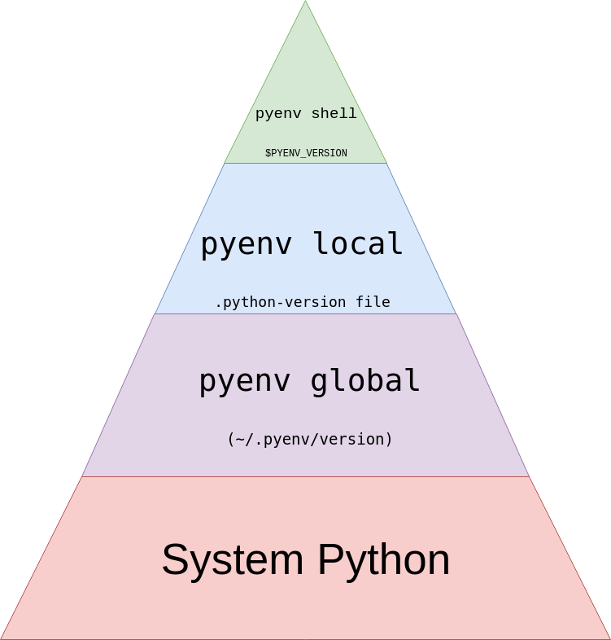
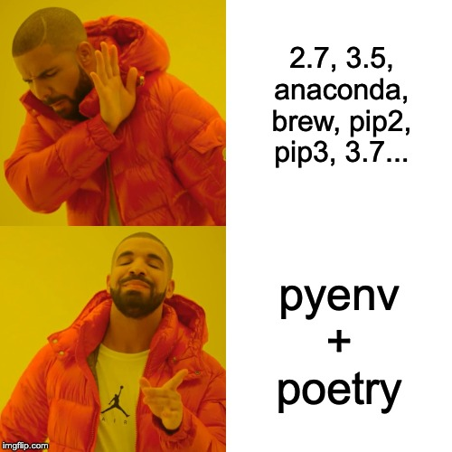

# Get started with pyenv & poetry. Saviours in the python chaos!


This file will give a quick walkthrough and demo of how you can setup and use pyenv and poetry, to make your python development life a little easier.

## Introduction
An introduction to [`pyenv`](https://github.com/pyenv/pyenv) and [`poetry`](https://python-poetry.org/) for python!

There’s no denying it. Python is one of the most widely used programming languages today.
Especially within Data Science.
However, there are few languages that can cause such chaos and frustration as python.
Handling different python-installations and dependencies can be a nightmare!

Let’s be thankful for `pyenv` and `poetry`, candles that light up the python darkness!
In this post I will show you how to install these two tools, and some basic usage examples.

## `pyenv`
pyenv is a python installation manager.
It allows you to install and run multiple python installations, on the same machine.
`pyenv` manages the different versions for you, so that you will avoid the chaos illustrated in the above picture.
Don’t ever again install a python version any other way!



The above image illustrates the hierarchy that pyenv uses to decide which installed python version to use.
From [realpython](https://realpython.com/intro-to-pyenv/).

### Setup & get started with `pyenv`
You can follow the steps below for installing on macOS.
I’m using [Homebrew](https://brew.sh/), but see the [`pyenv` documentation](https://github.com/pyenv/pyenv) for alternative installation methods.

```
# Install pyenv.
brew install pyenv

# Add pyenv initializer to shell startup script.
echo -e '\nif command -v pyenv 1>/dev/null 2>&1; then
  eval "$(pyenv init -)"
fi' >> ~/.bash_profile

# Reload your profile.
source ~/.bash_profile
```

With `pyenv` installed, you can install any python version that you would like.
Below I am installing some python versions.
Depending on which directory you’re in, `pyenv` will point to your specified python version.

```
# See all available python installations.
pyenv install --list

# Install some python versions.
pyenv install  3.7.6
pyenv install  2.7.17
pyenv install  3.8.1

# See all python installations that you have installed.
pyenv versions

# Set the default/global from one of the python versions.
pyenv global 3.8.1

# In the current directory, set the python version. This creates the file .python-version.
pyenv local 2.7.17

# To see which python is currently being used.
pyenv version
```

## `poetry`
`poetry` is a packaging and dependency manager.
It resolves your library dependencies, and can build and publish your project to be distributed on your private pypi repository.
In the beginning of December 2019, version 1.0.0 was finally released!

The main file of your poetry project is the `pyproject.toml` file.
Define the requirements, the dev-requirements and project metadata in this file.
`poetry` uses the `.toml` file to resolve the dependencies of your defined requirements, and creates the `poetry.lock` file.
Then poetry creates a virtual environment and installs everything from the `.lock` file.

(Some alternatives to poetry for virtual environments are `virtualenv`, `conda`, `venv` or `pipenv`.
I’ve used them all, especially `pipenv`.
However, I believe that `poetry is superior!)

### Setup `poetry`

As of writing, `poetry` is not yet available on Homebrew.
Follow the steps below for installing it.

```
# Install poetry via curl
curl -sSL https://raw.githubusercontent.com/python-poetry/poetry/master/get-poetry.py | python

# Add poetry to your shell
export PATH="$HOME/.poetry/bin:$PATH"

# For tab completion in your shell, see the documentation
poetry help completions

# Configure poetry to create virtual environments inside the project's root directory
poetry config virtualenvs.in-project true
```

With `poetry` installed, I can now create a python project.
I will define a project catered for data science.
`poetry` will install a virtual environment based on python 3.7.5, that I have already installed with `pyenv`.
I will include data analytics libraries like `pandas` and `scipy`, along with jupyter notebook.
In addition I will include the ML libraries `scikit-learn` and `tensorflow`.
Finally, I will specify `black` and `flake8` for formatting and style guiding.

```
# Specify the python version for the local directory using pyenv
pyenv local 3.7.6

# Create a new project, and directory
poetry new poetry_demo_project_1

# Specify some libraries
cd poetry_demo_project_1
poetry add pandas numpy scipy tensorflow tensorflow-text matplotlib scikit-learn jupyter ipykernel

# Specify some dev libraries
poetry add --dev black flake8
```
With the above commands, I have created a `pyproject.toml` file as well as a `poetry.lock` file.
`poetry` has installed the virtual environment for this project in `poetry_demo_project_1/.venv`.
The `pyproject.toml` file looks as follows.

```
[tool.poetry]
name = "poetry_demo_project_1"
version = "0.1.0"
description = ""
authors = ["Hugo Hjertén <hugo.hjerten@gmail.com>"]

[tool.poetry.dependencies]
python = "^3.7"
pandas = "^1.0.1"
numpy = "^1.18.1"
scipy = "^1.4.1"
tensorflow = "^2.1.0"
tensorflow-text = "^2.1.1"
matplotlib = "^3.1.3"
scikit-learn = "^0.22.2"
jupyter = "^1.0.0"
ipykernel = "^5.1.4"

[tool.poetry.dev-dependencies]
pytest = "^5.2"
black = "^19.10b0"
flake8 = "^3.7.9"

[build-system]
requires = ["poetry>=0.12"]
build-backend = "poetry.masonry.api"
```

### Get started with `poetry`

```
# The contents of my directory.
.python-version
poetry_demo_project_1/
    .venv/
    README.rst
    poetry_demo_project_1/
    	__init__.py
    	example.py
    poetry.lock
    pyproject.toml
    tests/
    	__init__.py
    	test_poetry_demo_project_1.py
```

I have added the `poetry_demo_project_1/example.py` file.
It’s contents are the the same as below.

```
'''An example file that imports some of the installed modules'''

import pandas as pd
import numpy as np
import tensorflow as tf
import tensorflow_text as text

if __name__ == "__main__":
    # If the modules can't be imported, the following print won't happen
    print("Successfully imported the modules!")
```

I can now run this python script from within that virtual environment.

```
# Try running the script outside your virtual environment. This won't work.
python poetry_demo_project_1/example.py

# Run the script within your virtual environment, using the 'run'-command.
poetry run python poetry_demo_project_1/example.py

# Spawn a shell within your virtual environment.
poetry shell

# Try running the script again, after having spawned the shell within your virtual environment.
python poetry_demo_project_1/example.py
```

## Conclusion

Above I have just provided you with the bare minimum to get you started.
For more details, please see the documentation for `pyenv` and `poetry`!
Your python life will be that much easier once you start using them both!



## Extra

### Use clean python versions

If you intend to use `poetry` and `pyenv`, use clean python versions.
In your `pyproject.toml` file you define the python version dependency, and individual library dependencies.
`pyenv` gives the possibility of installing python versions like `ironpython`, `cpython`, `anaconda` and `miniconda` versions.
For example, the `anaconda` python installation comes with many libraries preinstalled.
These preinstalled libraries won’t show up in your `pyproject.toml` or `poetry.lock` file.
Any dependencies baked into the non-clean python version will not be specified.
This makes it very difficult to share and recreate your environment/project.

### Using `jupyter` with `poetry`

`jupyter` works with **kernels**, and will not work out of the box with your virtual environment that `poetry` created for you.
If you wish to work in a `jupyter notebook` based on your virtual environment, you need to create a kernel for that virtual environment.
The code below explains how.
The prerequisite is that you have added both `jupyter` and `ipykernel` as dependencies in your `poetry` project.

```
# Make sure to run the command within your virtual environment. The 'poetry run' command ensures this
# Best practice is to use the same name for your kernel as the project.
poetry run ipython kernel install --user --name=hugos-ds-poetry-demo
```

### Death of virtual environments – PEP 582

Developing with python is constantly becoming easier and better, thanks to libs and enhancements by the growing python community.
One such Python Enhancement Proposals (PEP) is [PEP 582](https://www.python.org/dev/peps/pep-0582/).
This will avoid the steps to create, activate or deactivate “virtual environments”.
So let’s cross our fingers for this to be implemented asap! :)

### Problems installing python versions with `pyenv`

No tool is perfect, and unfortunately there are some drawbacks and issues when installing python versions with `pyenv`.
For instance, there is a delay from when a new python version has been released, to when it is available in `pyenv`.
New versions of python are available with upgrades of `pyenv`.

When installing a python version with pyenv you might encounter the following error, `zipimport.ZipImportError: can't decompress data; zlib not available`.
This is explained in more detail here, but the following fix might work for you.

```
# If you are experiencing zipimport.ZipImportError, the following fix might help!
brew install zlib
brew install sqlite
export LDFLAGS="${LDFLAGS} -L/usr/local/opt/zlib/lib"
export CPPFLAGS="${CPPFLAGS} -I/usr/local/opt/zlib/include"
export LDFLAGS="${LDFLAGS} -L/usr/local/opt/sqlite/lib"
export CPPFLAGS="${CPPFLAGS} -I/usr/local/opt/sqlite/include"
export PKG_CONFIG_PATH="${PKG_CONFIG_PATH} /usr/local/opt/zlib/lib/pkgconfig"
export PKG_CONFIG_PATH="${PKG_CONFIG_PATH} /usr/local/opt/sqlite/lib/pkgconfig"
```

Another error that you might encounter is `ar: internal ranlib command failed`.
For me, moving/removing the `ar` and `ranlib` directories did the trick.

```
# If you are experiencing 'ar: internal ranlib command failed', the following fix might help!
sudo mv /opt/local/bin/ranlib    /opt/local/bin/ranlib-backup
sudo mv /opt/local/bin/ar        /opt/local/bin/ar-backup
```